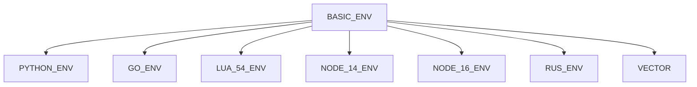
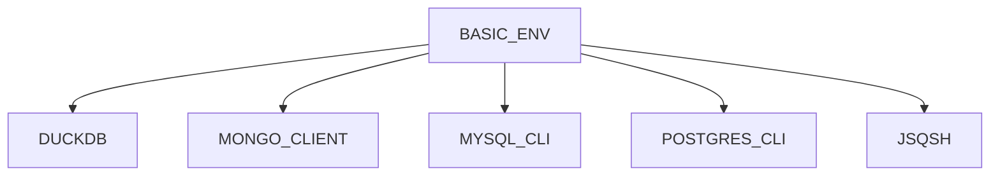
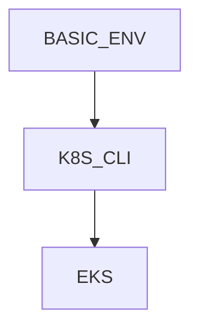

# docker-images

Common docker images to use as basic development environments without polluting my computer.

## Available Containers

### Languages

```mermaid
graph TD
  BASIC_ENV --> PYTHON_ENV
  BASIC_ENV --> GO_ENV
  BASIC_ENV --> LUA_54_ENV
  BASIC_ENV --> NODE_14_ENV
  BASIC_ENV --> NODE_16_ENV
  BASIC_ENV --> RUS_ENV
  BASIC_ENV --> VECTOR
```

### Databases

```mermaid
graph TD
  BASIC_ENV --> DUCKDB
  BASIC_ENV --> MONGO_CLIENT
  BASIC_ENV --> MYSQL_CLI
  BASIC_ENV --> POSTGRES_CLI
  BASIC_ENV --> JSQSH
```

### Tools

```mermaid
graph TD
  BASIC_ENV --> K8S_CLI
  K8S_CLI --> EKS
```
