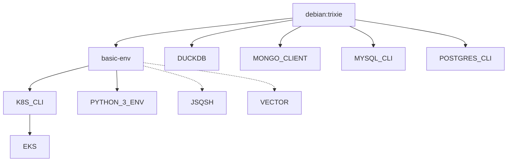

# docker-images

Common docker images to use as basic development environments without polluting my computer.

All images are published to Docker Hub under [`ronkitay`](https://hub.docker.com/u/ronkitay) as multi-arch (amd64 + arm64).

## Image Hierarchy

Solid edges = multi-arch aware (reference `basic-env:${RELEASE}-${ARCHITECTURE}`).
Dashed edges = legacy references (`basic-env:${RELEASE}`, no architecture suffix) — these **cannot be built by the current per-arch CI pipeline**.
Removed images: `go-env`, `lua-5.4-env`, `node-14-env`, `node-16-env`, `rust-env` were deleted (asdf covers those toolchains).

### Image Inventory

| Image | Base | Purpose | Multi-arch aware | Built by CI |
|---|---|---|---|---|
| `basic-env` | `debian` | Root image: zsh, oh-my-zsh, starship, tmux, zellij, fzf, ripgrep, homebrew, dotfiles | ✅ | ✅ |
| `python-3-env` | basic-env | Python 3.13 + pip/virtualenv/pipenv/poetry | ✅ | ✅ |
| `k8s-cli` | basic-env | kubectl, kubectx, krew (+stern), k9s, helm | ✅ | ✅ |
| `eks` | k8s-cli | AWS CLI v2 + eks helper scripts | ✅ | ✅ |
| `duckdb` | `debian` | DuckDB CLI (pinned version, downloaded at build) | ✅ (TARGETPLATFORM) | ✅ |
| `mongo-client` | `debian` | mongosh (pinned version) + launch script | ✅ (TARGETPLATFORM) | ✅ |
| `postgres-cli` | `debian` | PostgreSQL client 17 from pgdg + psqlrc | n/a (apt) | ✅ |
| `mysql-cli` | `debian` | mariadb-client + launch script | n/a (apt) | ❌ |
| `jsqsh` | basic-env ⚠️ | Java 17 + jsqsh SQL client with JDBC drivers | ❌ | ❌ |
| `vector` | basic-env ⚠️ | Vector.dev installer | ❌ | ❌ |

⚠️ = inherits via non-arch-suffixed tag; broken under the current CI model. Candidates for either fixing or removal.

## Versioning & Tagging

- The root **`release`** file holds the current release tag (e.g. `0.1.6`). Every image is tagged:
  - `ronkitay/<image>:<release>-amd64` and `ronkitay/<image>:<release>-arm64` (per-arch builds)
  - `ronkitay/<image>:<release>` (multi-arch manifest referencing both)
- Bumping the release = editing the `release` file and pushing to main; CI rebuilds and republishes everything it knows about.
- Consumers pin the release locally via `~/.my-docker-images.release`, which the wrapper scripts in `scripts/` read.
- The root **`versions`** file defines base-image build args passed to every build (currently `DEBIAN_VERSION=trixie`, overriding the `bookworm` defaults inside Dockerfiles, plus an unused `ALPINE_VERSION`).

## Build System

### Local builds

- `Makefile` — one target per image; each runs `docker build --platform linux/$ARCHITECTURE ... && docker push`. Manifest targets (`<image>-manifest`) create/push the multi-arch manifest.
- `init-env.sh` — sources Docker Hub credentials (`.dockerhub_username` / `.dockerhub_password`, untracked) and sets `ARCHITECTURE` from the local Docker daemon.
- Convenience wrappers: `build-all.sh`, `build-module.sh <image>`, `re-build-all.sh` (no-cache). `make all` covers all 14 leaf images (basic-env gets pulled in as a dependency).

### CI pipeline

`.github/workflows/release.yaml` triggers on every push to `main` (and manual dispatch):

1. For each of the **7 published images** (basic-env → python-3-env & k8s-cli → eks chain, duckdb, mongo-client, postgres-cli):
   - `docker-build` composite action: QEMU + buildx setup, Docker Hub login, then `ARCHITECTURE=<arch> make <target> -B -s`
   - amd64 job and arm64 job run independently; dependent images wait for their parent *of the same arch* (e.g. `eks_amd64_build` needs `k8s_cli_amd64_build`)
2. A `<image>_manifest` job merges both arches into the `:<release>` manifest via the `docker-manifest` action (`make <target>-manifest`)

Secrets required: `DOCKERHUB_USERNAME`, `DOCKERHUB_TOKEN`.

### Images NOT built by CI

`jsqsh`, `mysql-cli`, and `vector` have no workflow jobs — they are only built if run manually via `make`. They are dead weight unless revived: fix their base-image reference (add `-$(ARCHITECTURE)`) and add workflow jobs, or delete them.

## Client Scripts (`scripts/`)

Thin shell wrappers that launch containers from any machine:

- Each `<x>env` script pins its image name and resolves the tag from `~/.my-docker-images.release`, then calls `_docker_run_it` (interactive TTY container with an optional workspace mount via `_docker_workspace_builder`)
- Examples: `denv` (basic-env), `py3env`, `psqlenv`, `mysqlenv`, `duck`, `eks`
- The `.scripts` file is a fragment for Ron's tool manager exporting these onto `$PATH` with `#DOC#` help entries
